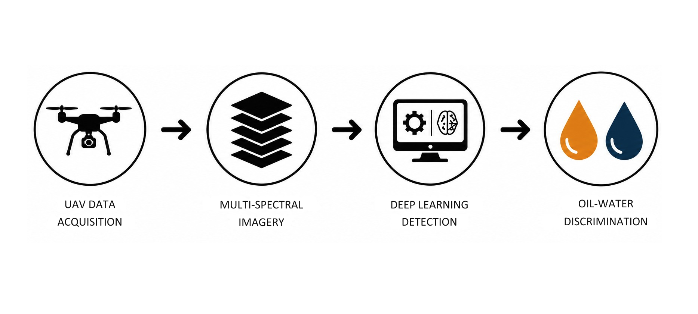

This project presents a UAV-based multispectral imaging framework for
detecting and distinguishing surface oil and water leaks over soil using
deep learning. The work addresses the challenge of differentiating oil
and water leaks, which can exhibit similar visual characteristics under
conventional RGB imaging but require different mitigation responses.

Multispectral data were acquired using a MicaSense RedEdge-P camera
mounted on a quadcopter. The system captured Blue, Green, Red, Red-Edge,
and NIR bands along with a high-resolution Panchromatic band. The imagery
was processed through radiometric correction, geometric band
co-registration, and pan-sharpening before being used for spectral
analysis and detection.

<figure>
    
    <figcaption>
        Figure: UAV-based multispectral imaging and deep learning pipeline for surface leak detection
    </figcaption>
</figure>

I performed band-wise spectral analysis to identify the most informative
bands for distinguishing oil and water over soil. The Red-Edge band
showed the strongest individual-band separability, with a Jeffries-Matusita
distance of 0.6545, followed by the Red band. The combined Red and
Red-Edge bands provided improved multivariate discrimination.

A dataset of 512 Red and Red-Edge images was constructed and annotated
with two classes: oil and water. The images were divided using an 80:20
training-validation split. Multiple object detection architectures were
evaluated, including YOLOv11, RT-DETR, Faster R-CNN, and a fusion-based
YOLOv11-RGBT model.

YOLOv11 and RT-DETR achieved the strongest overall detection performance.
YOLOv11 achieved an overall mAP@50 of 0.989 and mAP@50:95 of 0.806,
while RT-DETR achieved 0.992 and 0.798, respectively. YOLOv11 also
achieved an inference time of approximately 0.016 seconds per image,
demonstrating its potential for near-real-time deployment.

The system successfully detected oil leak volumes as low as 5 ml and
maintained detection performance under partial occlusion and
vegetation-induced shadowing. These results demonstrate the potential
of UAV multispectral sensing combined with deep learning for localized
and scalable surface leakage monitoring.

