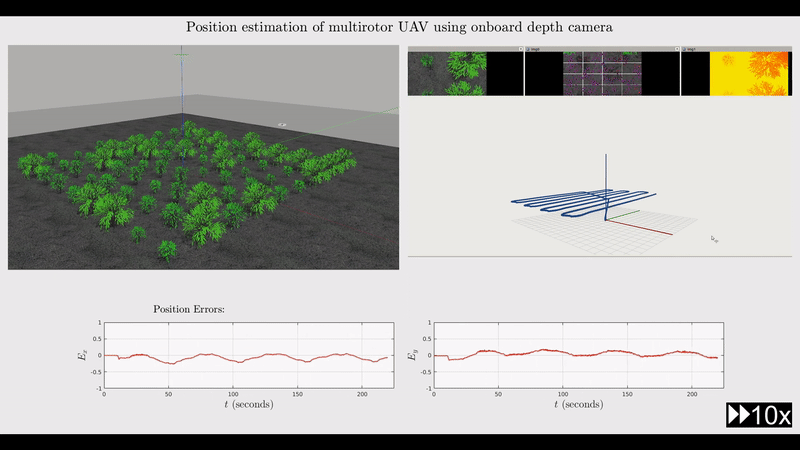
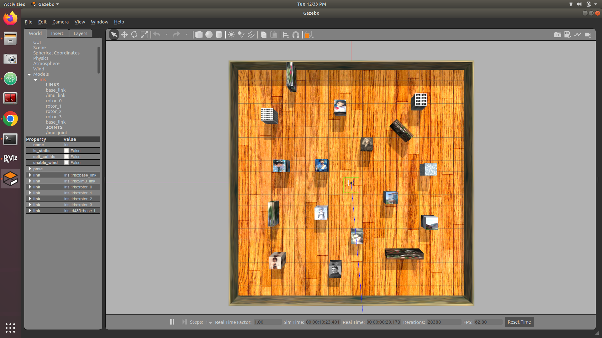
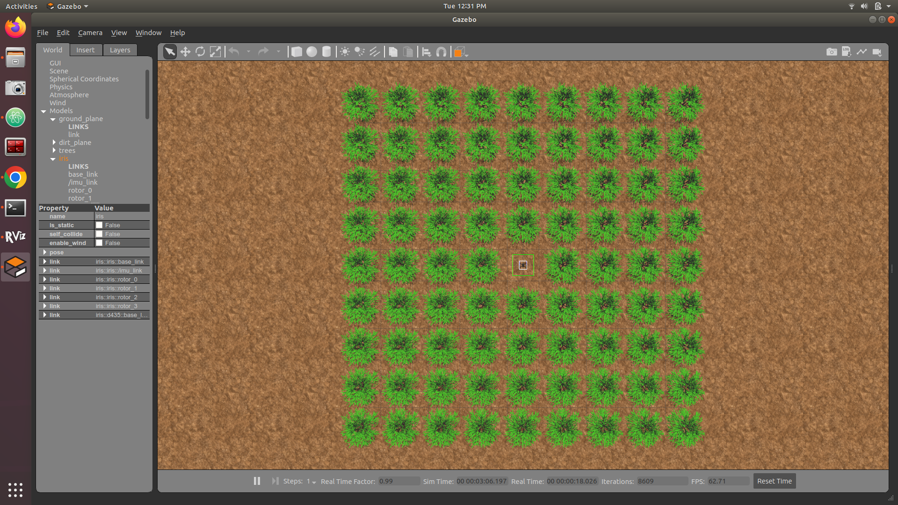
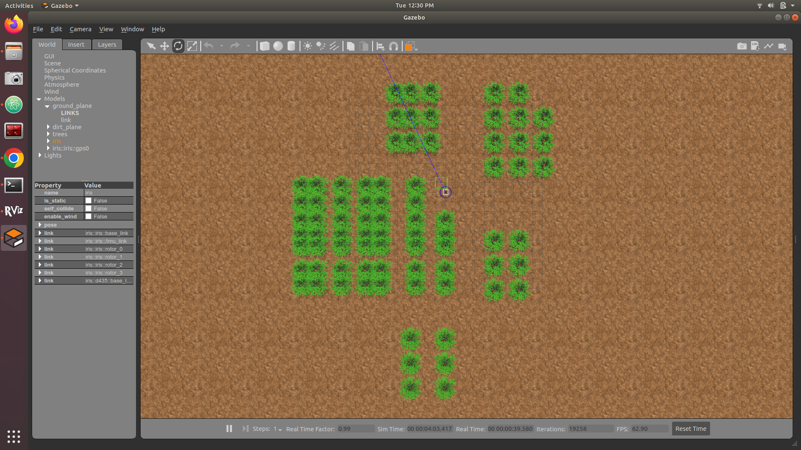
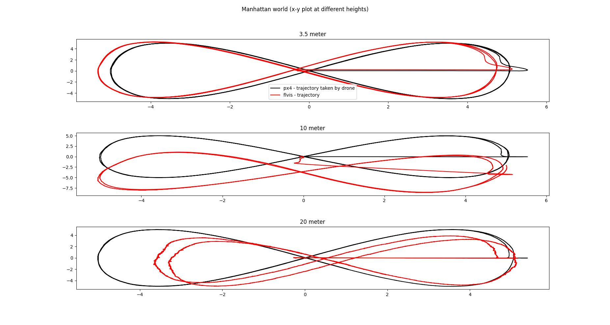
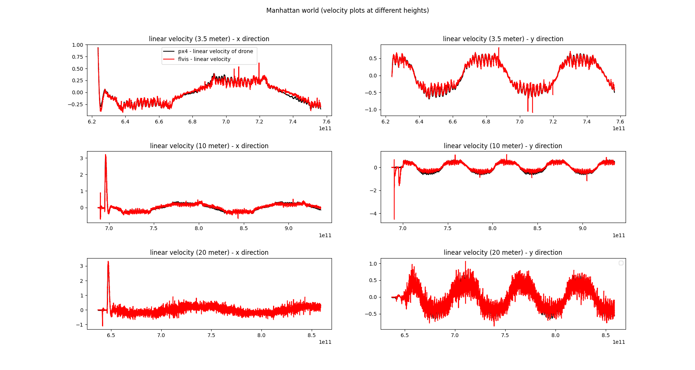
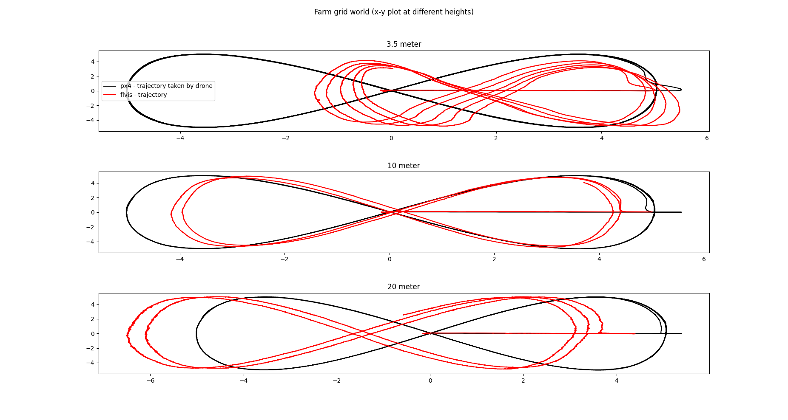
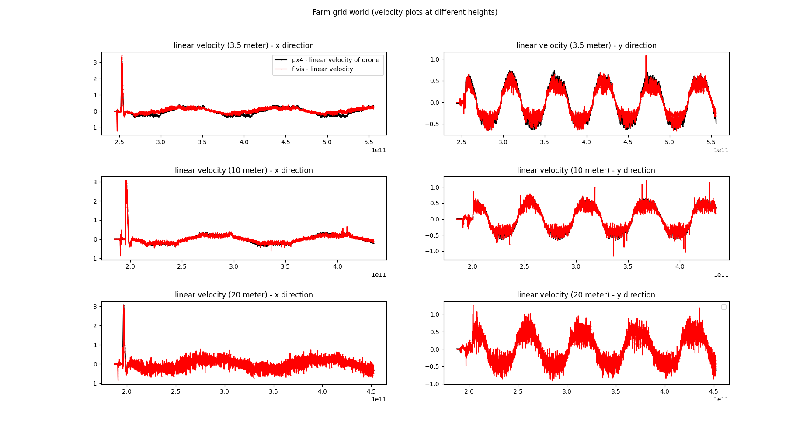
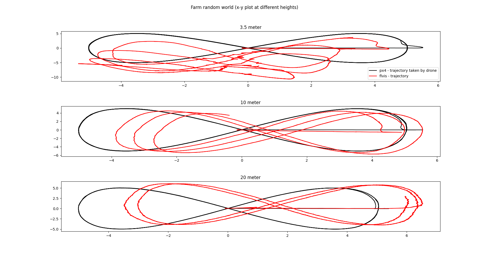
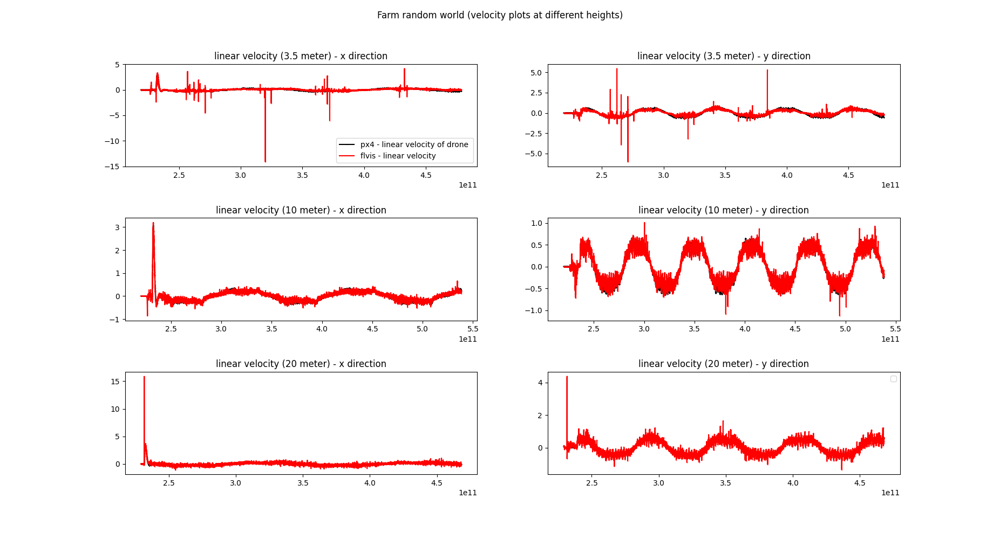

At TIH, IIT Bombay, I evaluated visual-inertial odometry (VIO) systems for
UAV pose estimation in precision agriculture. VIO combines visual
information from a camera with high-rate motion measurements from an IMU,
enabling pose estimation in GNSS-denied environments.

Agricultural environments present particular challenges for VIO due to
changing illumination, highly self-similar crop textures, unstructured
and dynamic objects, and irregular terrain that can produce more
aggressive camera motion than typical indoor or urban environments.

I simulated agricultural environments in Gazebo and evaluated a feedback-
based visual-inertial system (FVIS) for estimating the position and
orientation of an Iris quadcopter equipped with an Intel RealSense depth
camera.

<figure>
    
    <figcaption>
        Figure: Localization of an Iris quadcopter in a simulated agricultural field
    </figcaption>
</figure>

The implementation was evaluated in three simulated environments:

<ol>
  <li>Manhattan world with rich and diverse visual features</li>
  <li>Structured farm with a regular grid arrangement</li>
  <li>Unstructured farm with a randomly generated arrangement</li>
</ol>

  <figure>
    
    <figcaption>
      <a href="https://youtu.be/9dqaCNd7JSQ" target="_blank" rel="noopener">
        Manhattan World
      </a>
    </figcaption>
  </figure>

  <figure>
    
    <figcaption>
      <a href="https://youtu.be/7Z7jOObbWBc" target="_blank" rel="noopener">
        Farm Grid World
      </a>
    </figcaption>
  </figure>

  <figure>
    
    <figcaption>
      <a href="https://youtu.be/cHfQndy20NI" target="_blank" rel="noopener">
        Farm Random Arrangement
      </a>
    </figcaption>
  </figure>

The experiments compared the drone's true flight path and velocity
profile with the trajectory and speed estimates generated by the
VIO-based localization system at flight heights of 3.5 m, 10 m, and
20 m.

<table>
  <tr>
    <td>
      <figure>
        
        <figcaption>
          Manhattan world: position plots at different heights
        </figcaption>
      </figure>
    </td>

    <td>
      <figure>
        
        <figcaption>
          Manhattan world: velocity plots at different heights
        </figcaption>
      </figure>
    </td>
  </tr>

  <tr>
    <td>
      <figure>
        
        <figcaption>
          Farm grid world: position plots at different heights
        </figcaption>
      </figure>
    </td>

    <td>
      <figure>
        
        <figcaption>
          Farm grid world: velocity plots at different heights
        </figcaption>
      </figure>
    </td>
  </tr>

  <tr>
    <td>
      <figure>
        
        <figcaption>
          Random farm world: position plots at different heights
        </figcaption>
      </figure>
    </td>

    <td>
      <figure>
        
        <figcaption>
          Farm random world: velocity plots at different heights
        </figcaption>
      </figure>
    </td>
  </tr>
</table>
