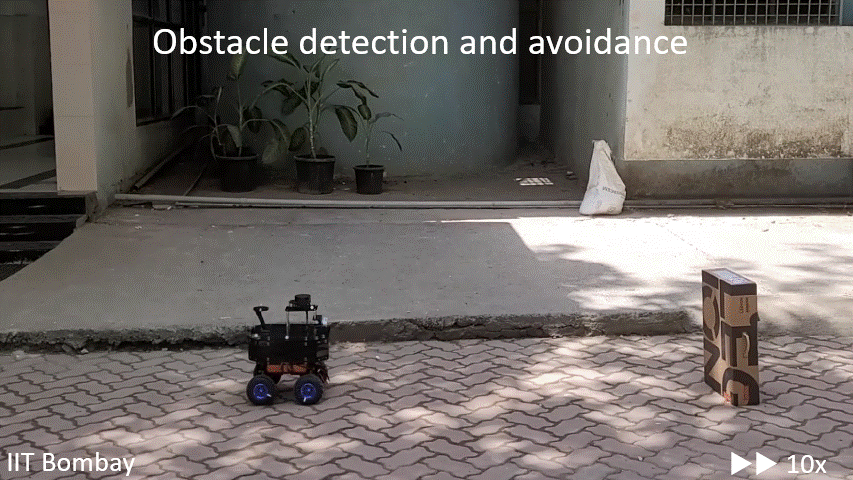

To achieve autonomous navigation for a ground robot, I worked on the development of:

<ul>
  <li>Encoder-based low-level controller developed with Raspberry Pi Pico.</li>
  <li>Sensor fusion for robot localization using wheel encoders and orientation sensors.</li>
  <li>Velocity controller design for LiDAR-based obstacle avoidance using NVIDIA Jetson Orin Nano.</li>
</ul>

<figure>
    
    <figcaption>Figure: Autonomous navigation and obstacle avoidance for ground robot</figcaption>
</figure>

  

    <figure>
        
        <figcaption>Figure 2: Obstacle avoidance with TurtleBot</figcaption>
    </figure>
  

  

    

    The aim of this project was to develop a prototype rover that could be
    scaled for vineyard data collection. The velocity controller was also
    tested on a TurtleBot to validate the obstacle avoidance performance.
    

  

