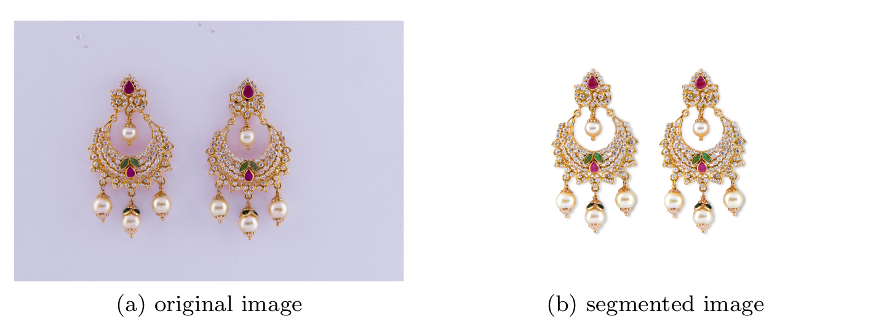
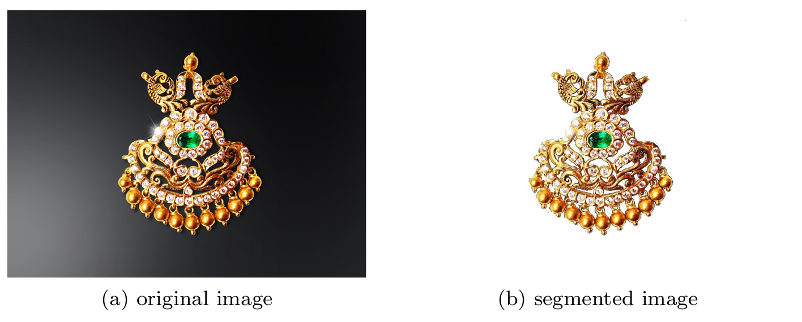

In digital image processing and computer vision, image segmentation is the process
of partitioning a digital image into multiple segments. It simplifies image
analysis by assigning labels to different regions, which can support subsequent
object detection and image-processing tasks.

I worked as a Project Assistant at the Multimodal Perception Laboratory,
International Institute of Information Technology, Bangalore, where I analyzed
different image segmentation algorithms and developed an algorithm for segmenting
the background of shared jewellery images.

The objective was to replace the original background with a transparent
background, allowing vendors to further edit the images and prepare them for
use on online selling platforms.

Figures 1 and 2 show the performance of the segmentation algorithm on original
images provided by the vendors.

<figure>
    
    <figcaption>
        Figure 1: Segmentation algorithm — best case
    </figcaption>
</figure>

<figure>
    
    <figcaption>
        Figure 2: Segmentation algorithm — worst case
    </figcaption>
</figure>
