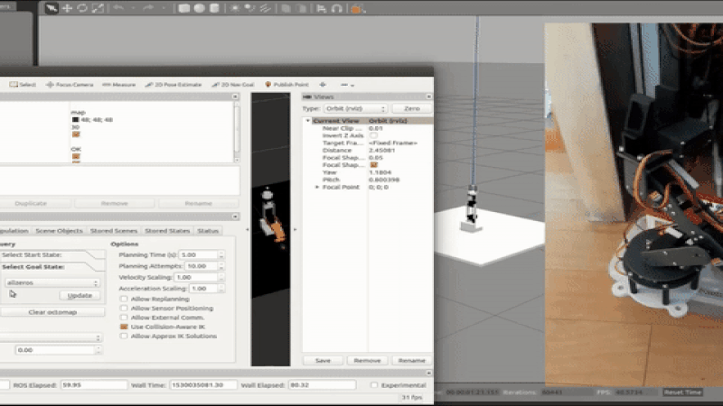
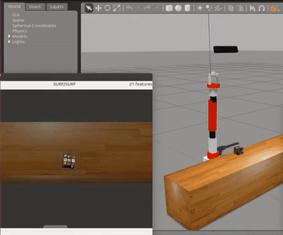

At Dhristi Works, I worked on the development of robotic systems for
automated beach cleaning. My focus was on developing algorithms for a
robotic manipulator to perform pick-and-place tasks, with the intended
application of identifying and collecting garbage and placing it into a
bag or bin mounted on a mobile rover.

I used ROS to interface a 5-DOF robotic arm with the Gazebo simulator,
enabling the robot to be controlled through ROS in both simulated and
real environments. This provided a common software interface for
developing and testing manipulation algorithms before deployment on the
physical robot.

<figure>
    
    <figcaption>
        Figure 1: Robotic manipulator controlled through ROS in simulated and real environments
    </figcaption>
</figure>

  <!-- Description -->
  

    

      For object grasping, I compared and analyzed several available grasping
      techniques and interfaced the selected approach with the simulated robot.
      The system was evaluated on household objects in a simulated environment
      as a step toward autonomous garbage collection.
    

  

  <!-- Image -->
  <figure style="
    margin: 0;
    text-align: center;
  ">
    
    <figcaption style="
      margin-top: 10px;
      text-align: center;
    ">
      Figure 2: Robotic arm grasping household objects in simulation
    </figcaption>
  </figure>

