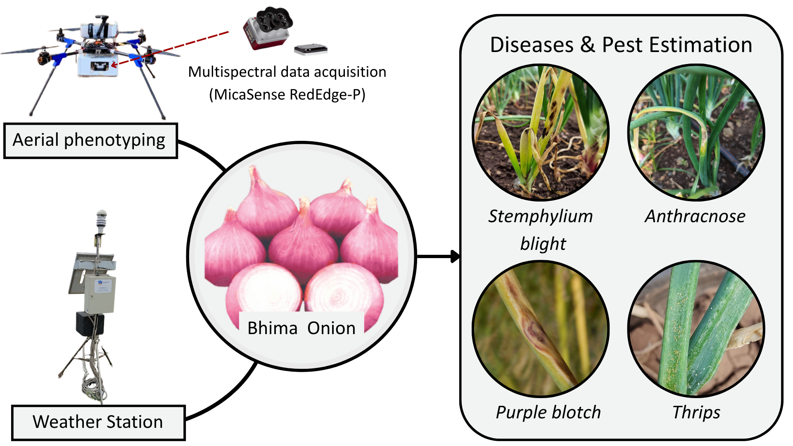

<figure>
    
    <figcaption style="text-align: center;">
        Figure: UAV multispectral and weather-based framework for onion disease and pest estimation
    </figcaption>
</figure>

Onion crops are highly vulnerable to a range of diseases and pests, which can lead to significant yield losses if timely detection and intervention are not achieved. This study presents a multimodal framework that integrates spectral indices derived from UAV-based multispectral imagery with meteorological data to estimate the incidence of major onion stressors under controlled field conditions. Data were collected from experimental plots of the Bhima onion variety across multiple growth stages, where stemphylium blight, anthracnose, purple blotch, and thrips co-occurred at naturally varying intensities. Fourteen vegetation indices (VI) and four weather variables were evaluated under untreated (no-spray) conditions to determine which features most reliably predict crop health and stress intensity. Beyond conventional indices, we incorporated derived features capturing temporal changes, lag effects, and biomass normalization, which significantly enhanced sensitivity to stress dynamics. Among all evaluated features, a newly introduced vegetation index, referred to as the Green Stress Ratio, consistently demonstrated the strongest associations across all disease and pest categories. A two-stage classification–regression framework was employed to first detect the presence of a stressor and subsequently quantify its severity, with models evaluated independently for each disease and pest. The results highlight the effectiveness of combining UAV-derived multispectral data with weather information for non-invasive, field-scale monitoring of onion crop health. This integrated approach provides a foundation for advanced decision-support systems aimed at targeted and sustainable pest and disease management in onion cultivation.

