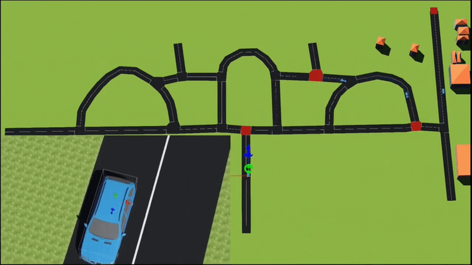

For autonomous vehicles to navigate roads, a robust path planning system is
required. Such a system involves high-level planning, including route
selection and path generation, as well as lower-level planning for behavior
selection, motion planning, and obstacle avoidance.

During my work at the Indian Institute of Technology Bombay, I designed and
developed several modules of a reactive path planning system for autonomous
mobile vehicles. The system enabled a team of car-like robots to navigate
predefined areas using information from a world map.

<figure>
    
    <figcaption>
        Figure: Multiple car-like robots traversing roads in an area selected from the world map
    </figcaption>
</figure>
