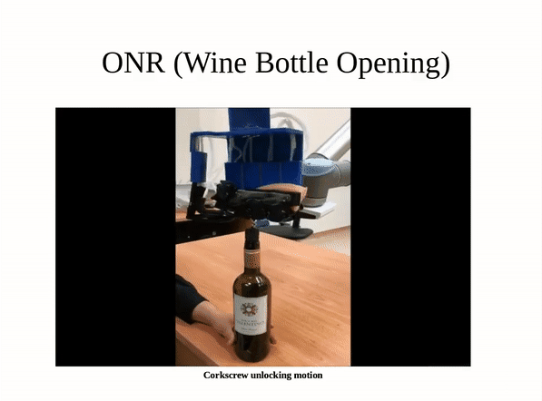
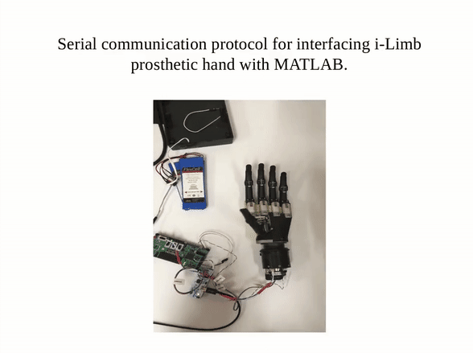

  <figure style="float:left; width:100%">
    
    <figcaption style="text-align:center">
      (a) Bread cutting task
    </figcaption>
  </figure>

  <figure style="float:left; width:50%">
    
    <figcaption style="text-align:center">
      (b) Corkscrew unlocking task
    </figcaption>
  </figure>

  <figure style="float:left; width:50%">
    
    <figcaption style="text-align:center">
      (c) Programmatic control of a robotic hand
    </figcaption>
  </figure>

As part of my research at the Singapore Institute of Neurotechnology
(SINAPSE), National University of Singapore, and in collaboration with
the Office of Naval Research Singapore, I worked with a team of research
scientists on robotic manipulation for everyday tasks.

My work focused on motion planning and control of robotic systems. I
developed motion trajectories including zig-zag and spiral motions for
tasks such as bread cutting and opening a corkscrew on a wine bottle.
I also developed an interface for programmatic control of the individual
digits of a robotic hand.

