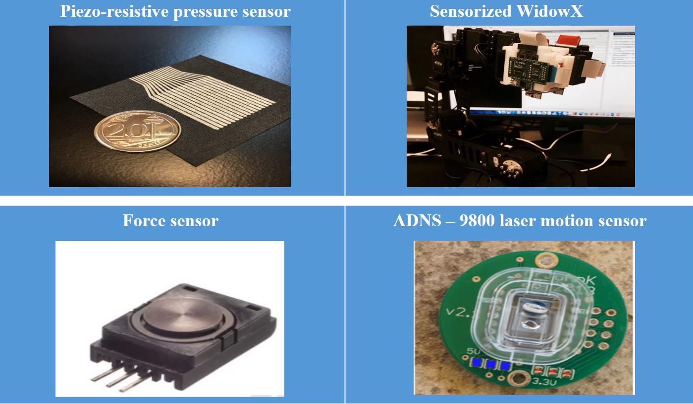

<figure>
    
    <figcaption>
        Figure: Slip control experimental setup
    </figcaption>
</figure>

To study the occurrence of slippage when mass is added to an object
gripped by a robotic end-effector, I designed an experimental setup to
recreate slip conditions and evaluate friction models developed by a
post-doctoral fellow.

I developed a high-density tactile sensor array designed to fit the
surface of the WidowX parallel gripper and built the associated
circuitry for acquiring tactile, force, and optical sensor data.
The sensing system was designed to acquire data at 0.01-second
intervals using Simulink.

The sensor measurements provided information about the magnitude and
direction of forces acting on the gripped object, which served as
inputs to the friction model and controller. I also developed an
interface for controlling the robot orientation and adjusting the
gripper position through micromotions at 0.01-second intervals.

These high-speed micromotions enabled the WidowX gripper to rapidly
adjust its grip once a slip event was detected by the friction
model and controller.

