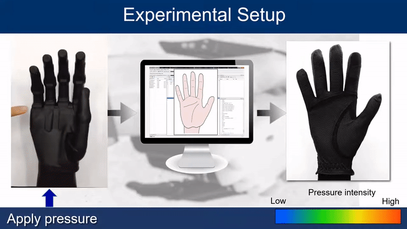

This project focused on developing a telerobotic interface that enables
a remote human operator to perceive the sense of touch experienced by
a robotic hand. The system consisted of a sensorized tactile glove,
a haptic glove, and an interface connecting the two.

<ul>
  <li>
    <b>Tactile glove:</b> Developed a fabric-based tactile sensor array
    integrated with a robotic hand to measure pressure applied by external
    objects.
  </li>

  <li>
    <b>Haptic glove:</b> Developed a wearable haptic interface designed
    to render and replicate the sense of touch for a remote operator.
  </li>

  <li>
    <b>Interface:</b> Developed a first-generation interface that mapped
    the pressure measured by the sensorized robotic hand to equivalent
    vibratory feedback on the haptic glove worn by the user.
  </li>
</ul>

The interface enabled the intensity of the vibration experienced by the
remote operator to vary according to the pressure applied to the robotic
hand, providing a tactile feedback mechanism for interacting with
distant and inaccessible environments.

<figure>
    
    <figcaption>
        Figure: Tactile and haptic glove interface
    </figcaption>
</figure>
